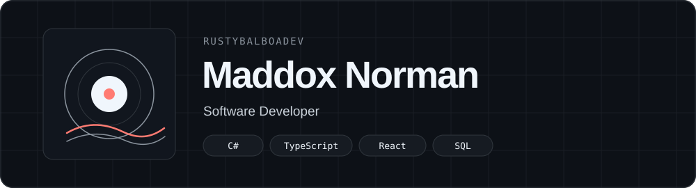

<picture>
  <source media="(prefers-color-scheme: dark)" srcset="./assets/header-dark.svg">
  <source media="(prefers-color-scheme: light)" srcset="./assets/header-light.svg">
  
</picture>

<h3 align="center">
  <a href="https://maddoxnorman.com">🌐</a>
  &nbsp;&nbsp;·&nbsp;&nbsp;
  <a href="mailto:maddoxnormandev@gmail.com">✉️</a>
  &nbsp;&nbsp;·&nbsp;&nbsp;
  <a href="https://twitter.com/rustybalboadev">𝕏</a>
</h3>

  Developer, FOSS Advocate, passionate about creating things with code, exploring new tools, and understanding how technology works behind the scenes.

<h2 align="center">Projects</h2>

<table>
<tr>
<td width="50%" valign="top">
<h3 align="center">🔍 Yoink.Rip</h3>

Grabify remake with more realistic domains.

<a href="https://github.com/rustybalboadev/yoink-public"><b>View Repository →</b></a>

</td>
<td width="50%" valign="top">
<h3 align="center">📈 goStock</h3>

A Go tool for checking and tracking stock information from the command line.

<a href="https://github.com/rustybalboadev/goStock"><b>View Repository →</b></a>

</td>
</tr>
<tr>
<td width="50%" valign="top">
<h3 align="center">📥 CLI-Down</h3>

Download images and videos from various websites directly from your terminal.

<a href="https://github.com/rustybalboadev/CLI-Down"><b>View Repository →</b></a>

</td>
<td width="50%" valign="top">
<h3 align="center">🖼️ EXIFExtractor</h3>

Extract and inspect EXIF metadata embedded inside image files.

<a href="https://github.com/rustybalboadev/EXIFExtractor"><b>View Repository →</b></a>

</td>
</tr>
</table>

<h3 align="center">Currently Listening</h3>

---

  

<h3 align="center">What I've Been Listening to This Week</h3>

---

 

  

